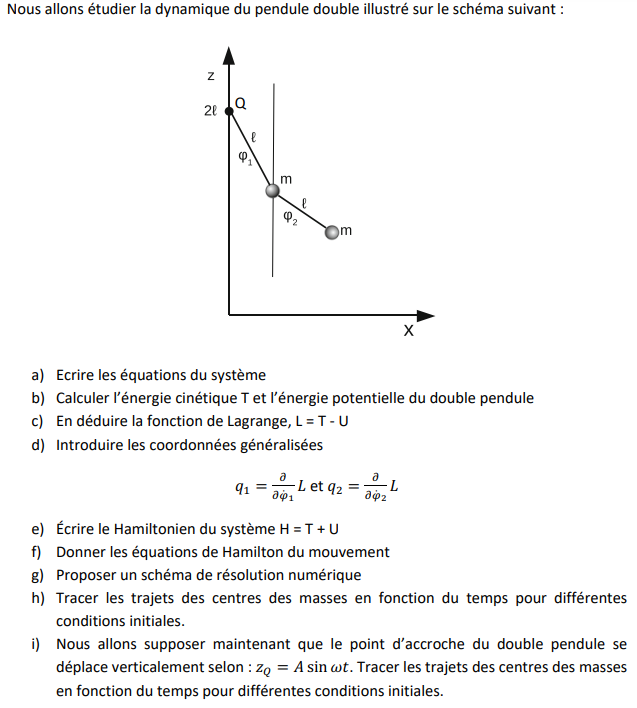

# Pendulum simulation

Welcome to my pendulum simulation project !  
Here, you'll be able to simulate simple pendulum and double pendulum equations with or without an oscillating origin point. You can control a few parameters in order for the simulation to fit you best.
## Context

In my first year of engineering school, I had to implement this project in a team of four students :

 

We split the work like so :
They had to solve all the equations so that I could embed them in a Python Graphical User Interface (GUI).
At that moment, I had no knowledge of GUI or Object Oriented Programming (OOP) but with the guidance of qualified friends and Python TKinter documentation, I managed to launch a first version. Everyone can see it [here](https://github.com/KIMOUGINOT/PMI).

However, I coded it very badly and some bugs still remained so I decided now that I am more qualified to clean this up. That's why I created this repository where i slowly enhance every part of this project.

## Main functions

You can simulate 4 situations :

- A simple pendulum with a fixed non-movable extremity.

- A forced simple pendulum : it's a simple pendulum whose formerly non-movable extremity now oscillate at a frequency w and an amplitude A.

- A double pendulum : it's a simple pendulum who possess another simple pendulum at one of its extremity (the other one is fixed and non-movable).

- A forced double pendulum : it's a double pendulum whose formerly non-movable extremity now oscillate at a frequency w and an amplitude A.
